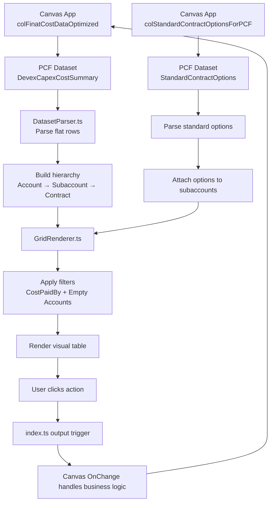
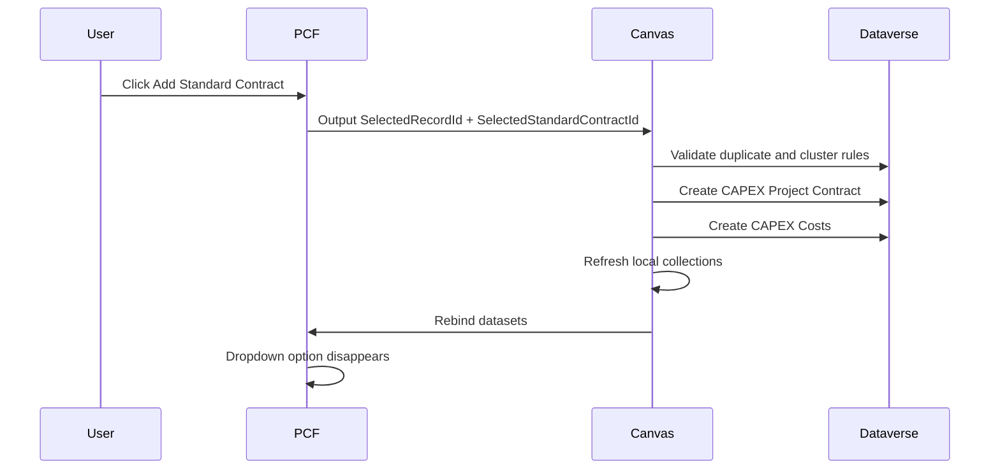
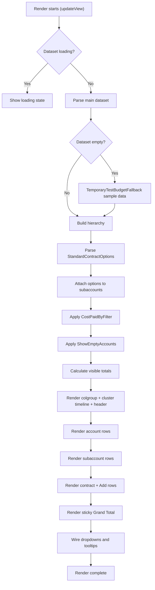

# 🧭 DevexCapexSummaryPCF — Visual Developer Guide

This visual guide explains how the PCF works from Canvas data input to final rendered UI. It is designed for new developers who need to understand the control quickly — in **10–15 minutes** — without reading every TypeScript file first.

> 📚 Companion docs: [README.md](README.md) (full reference) · `CLAUDE_CODE_HANDOFF_CONTEXT.md` (project history) · the in-code comments in every TS/CSS file.

---

## 🧠 1. What this PCF does

> **In one line:**
> This PCF renders DEVEX/CAPEX costs as a hierarchical grid:
> **Account → Subaccount → Contract**

### Key things this PCF handles

✅ Account / Subaccount / Contract hierarchy with expand/collapse tree lines
✅ Monthly cost columns (selected year only)
✅ All-years Total Cost
✅ Planned / Actual cost columns (toggleable)
✅ Standard contract highlighting (blue)
✅ DevCo / SPV cost filtering
✅ Empty account hiding
✅ Add / Edit / Delete / Comment actions
✅ Add Standard Contract action (with submenu)
✅ Set month cost as paid / unpaid
✅ Comment red dots + hover tooltips (contract + month level)
✅ Cluster timeline header above the months
✅ Canvas output triggers (PCF never touches Dataverse)

---

## 🧱 2. Big-picture architecture

```text
┌─────────────────────────────────────────────────────────────┐
│                    Power Apps Canvas App                     │
│  Builds collections, applies business rules, talks to DV    │
└──────────────────────────────┬───────────────────────────────┘
                               │
                               ▼
┌─────────────────────────────────────────────────────────────┐
│                  PCF Input Datasets / Props                  │
│  DevexCapexCostSummary + StandardContractOptions             │
│  + StartYear, ShowPlannedCost, filters, cluster dates        │
└──────────────────────────────┬───────────────────────────────┘
                               │
                               ▼
┌─────────────────────────────────────────────────────────────┐
│                       DatasetParser.ts                       │
│  Converts flat Canvas rows into Account → Subaccount → Cost  │
└──────────────────────────────┬───────────────────────────────┘
                               │
                               ▼
┌─────────────────────────────────────────────────────────────┐
│                       GridRenderer.ts                        │
│  Applies filters, renders rows, totals, dropdowns, styling   │
└──────────────────────────────┬───────────────────────────────┘
                               │
                               ▼
┌─────────────────────────────────────────────────────────────┐
│                          index.ts                            │
│  Handles PCF lifecycle + sends action outputs to Canvas      │
└──────────────────────────────┬───────────────────────────────┘
                               │
                               ▼
┌─────────────────────────────────────────────────────────────┐
│                     Canvas OnChange Logic                    │
│  Creates/edits/deletes records, refreshes PCF collections    │
└─────────────────────────────────────────────────────────────┘
```



> 🧷 Fun fact you must know: the Canvas collection really is called **`colFinatCostDataOptimized`** — the "Finat" typo is intentional/legacy. Don't "fix" it.

---

## 🌳 3. Row hierarchy visual

```text
🌳 Account Row                 (Type = "account")
   └── 📁 Subaccount Row       (Type = "subaccount")
       ├── 📄 Contract Row     (Type = "contract")
       ├── 📄 Contract Row
       ├── 🔵 Standard Contract Row
       └── ➕ Add Row           (generated by the PCF, not by Canvas)
─────────────────────────────────────────────────────────────────
Σ  Grand Total Row             (sticky at the bottom)
```

| Level | Meaning | Example Behavior |
| --- | --- | --- |
| 🌳 Account | Main cost category group | Bold gray row, sums of its children, expand/collapse |
| 📁 Subaccount | Child cost bucket | Light gray row, owns the ➕ Add row and standard options |
| 📄 Contract | Actual cost line | White row, can be edited / deleted / commented / paid |
| 🔵 Standard Contract | Contract created from a standard assumption | Same as contract, highlighted blue `#006EB9` |
| ➕ Add row | PCF-generated action row under each subaccount | Opens the Add dropdown |
| Σ Grand Total | PCF-computed footer | Sticks to the bottom of the allocated height |

---

## 🖼️ 4. UI layout mockup

```text
                ┌── Cluster 2 ──┐┌──────── Cluster 3 ────────┐      ← cluster timeline pills
┌──────┬──────────────────────────┬───────────┬─────────┬─────────┬──────┬──────┬─────┬──────┬───┐
│ Sl.No│ Account Name             │ Total     │ Planned │ Actual  │01.26 │02.26 │ ... │12.26 │ ⋮ │
├──────┼──────────────────────────┼───────────┼─────────┼─────────┼──────┼──────┼─────┼──────┼───┤
│ 1000 │ ▼ 🌳 Wind Turbines        │ 1,200,000 │ 800,000 │ 400,000 │  400 │  480 │ ... │  560 │   │
│ 1100 │   ▼ 📁 Turbine Supply     │   900,000 │ 600,000 │ 300,000 │  400 │  480 │ ... │  560 │   │
│      │     ├ 📄 Contract A 🔴    │   500,000 │ 300,000 │ 200,000 │ ▓400 │  180 │ ... │   60 │ ⋮ │
│      │     ├ 🔵 Standard B       │   400,000 │ 300,000 │ 100,000 │    – │ ▓300 │ ... │  500 │ ⋮ │
│      │     └ ➕ Add              │           │         │         │      │      │     │      │   │
├──────┼──────────────────────────┼───────────┼─────────┼─────────┼──────┼──────┼─────┼──────┼───┤
│  Σ   │ Grand Total              │ 1,200,000 │ 800,000 │ 400,000 │  400 │  480 │ ... │  560 │   │ ← sticky bottom
└──────┴──────────────────────────┴───────────┴─────────┴─────────┴──────┴──────┴─────┴──────┴───┘
         ▓ = paid month (green #D6E7B3)   🔴 = comment red dot   ⋮ = three-dot action menu
```

> 💡 **Important:**
> `Total Cost` is the **all-years** cost from Canvas.
> `01.26 – 12.26` are **selected-year** monthly values only (`StartYear` input).
> The table never squeezes below its minimum widths — it grows and scrolls horizontally instead.

---

## 📦 5. Data packets coming from Canvas

### 📦 Dataset 1: `DevexCapexCostSummary`

This is the main grid dataset (bound to `colFinatCostDataOptimized`).

It contains:
- account rows, subaccount rows, contract rows (flat, linked by `RowId`/`ParentId`/`Type`)
- monthly values `M1`–`M12` (selected year)
- `TotalCost` / `PlannedCost` / `ActualCost` (all-years)
- paid flags `M1Paid`–`M12Paid` (alias `Month1Paid`…)
- standard contract flags (`IsStandardContract` + aliases)
- `CostPaidBy` (DevCo/SPV), `DistributionType`, `SubLabel`
- comment fields: `HasComments`, `CommentTooltip`, `M1HasComments`/`M1CommentTooltip` … `M12`

### 📦 Dataset 2: `StandardContractOptions`

This controls the Add Standard Contract dropdown (bound to `colStandardContractOptionsForPCF`).

It contains:
- `StandardContractId` — standard assumption id
- `SubaccountId` — matching subaccount id (= subaccount `RowId`)
- `Name` — display name
- `AutoId` — sorting id (sorted in Canvas)

```text
Canvas collection row
        ↓
PCF dataset record
        ↓
DatasetParser model  (AccountData / SubaccountData / ContractData)
        ↓
Grid row
```

> 🛡️ `DatasetParser` is **alias-tolerant**: field names are matched case-insensitively after stripping everything except `a-z0-9`, and most fields accept several spellings (`M1Paid`, `Month1Paid`, `PaidM1`, …). When in doubt, send the canonical names from §5 of the README.

---

## 🧬 6. Flat data to hierarchy transformation

```text
Canvas sends flat rows:                 PCF transforms into:

[Account A]                             Account A
[Subaccount A1]                         ├── Subaccount A1
[Contract A1-1]                         │   ├── Contract A1-1
[Contract A1-2]              ──────▶    │   └── Contract A1-2
[Subaccount A2]                         └── Subaccount A2
[Contract A2-1]                             └── Contract A2-1
```

### Matching rule

| Row Type | Uses |
| --- | --- |
| Account | `RowId` (no parent) |
| Subaccount | `ParentId` points to Account `RowId` |
| Contract | `ParentId` points to Subaccount `RowId` |

> 🚨 If contracts do not show, first check:
> - `Type = contract` (exact value)
> - contract `ParentId`
> - subaccount `RowId`
> - GUID casing / spaces (the parser lowercases IDs, but they must be the same GUID)

---

## 🔢 7. Cost value logic

```text
                       ┌─────────────────────────────┐
                       │        Canvas App           │
                       └──────────────┬──────────────┘
                                      │
          ┌───────────────────────────┴───────────────────────────┐
          ▼                                                       ▼
┌─────────────────────┐                               ┌─────────────────────┐
│ TotalCost           │                               │ M1 - M12            │
│ All-years total     │                               │ Selected year only  │
└──────────┬──────────┘                               └──────────┬──────────┘
           ▼                                                     ▼
┌─────────────────────┐                               ┌─────────────────────┐
│ Total Cost column   │                               │ Month columns       │
└─────────────────────┘                               └─────────────────────┘
```

| Field | Meaning | UI Column |
| --- | --- | --- |
| `TotalCost` | All-years total | Total Costs |
| `PlannedCost` | Planned/unpaid total (all-years) | Total Planned Cost |
| `ActualCost` | Paid/actual total (all-years) | Total Actual Cost |
| `M1`–`M12` | Selected year monthly values | 01.xx – 12.xx |
| `M1Paid`–`M12Paid` | Paid indicator per month | Green paid styling |

> 🚨 **The golden rule:** the PCF must **never** compute the all-years total by summing `M1`–`M12`. That bug existed once — totals silently became selected-year-only. Canvas computes all-years totals; the PCF just displays them (and only re-aggregates *visible* rows after UI filtering).

> 🌍 Numbers are formatted with the **browser locale**: an English browser shows `1,000`, a German browser shows `1.000`. This is intentional.

---

## 🔵 8. Standard contract visual behavior

> 🔵 **Standard Contract Rows**
> These are contracts created from standard assumptions.
> They are highlighted in the app theme blue `#006EB9`.

```text
Canvas contract row
        ↓
IsStandardContract / IsStandard / StandardCost / StandardContract
(or ||STD=1|| token in SubLabel, or name starting with "Standard ")
        ↓
DatasetParser detects standard flag → isStandardContract: true
        ↓
GridRenderer adds row class  pcf-row-standard
        ↓
CSS paints the row text blue
```

| Step | File | Responsibility |
| --- | --- | --- |
| 1 | Canvas | Sends standard flag (convert Dataverse choice → boolean: `CPC.'Is Standard Contract?' = '…'.Ja`) |
| 2 | DatasetParser.ts | Converts flag to boolean (many aliases + fallbacks) |
| 3 | GridRenderer.ts | Adds `pcf-row-standard` row class |
| 4 | CSS | Applies blue styling |

---

## 🧩 9. Action menus visual

There are **three** menus. They are all appended to `document.body` so the scroll container can't clip them.

### ➕ Add dropdown (on the subaccount Add row)

```text
📁 Subaccount Row
   └── ⋯ Add

┌──────────────────────────────┐
│ ➕ Add New Cost              │
│ ➕ Add Standard Contract  ▸  │──▶ ┌────────────────────┐
└──────────────────────────────┘    │ Standard Cost A    │
                                    │ Standard Cost B    │
  ⚠ exactly 1 option → no submenu,  │ Standard Cost C    │
    the item triggers directly      └────────────────────┘
  ⚠ 0 options → the standard item
    is NOT rendered at all
```

### ⋮ Contract three-dot menu

```text
📄 Contract Row ──▶ ⋮

┌──────────────────┐
│ ✏️ Edit          │
│ 💬 Comments  🔴  │   ← red dot when the contract has comments
│ 🗑 Delete        │
└──────────────────┘
```

### 💵 Month cell dropdown (click a month cost cell)

```text
normal contract:                cluster/equal-distributed contract:
┌─────────────────────┐         ┌─────────────────────────┐
│ 💵 Set as paid      │         │ 💵 Set as paid  ⓘ       │  ← disabled, gray
│ 💬 Comments         │         └─────────────────────────┘
└─────────────────────┘           hover anywhere on the row:
                                  ┌──────────────────────────────────────────────┐
                                  │ Cluster-distributed costs cannot be marked   │
                                  │ as paid.                                     │
                                  └──────────────────────────────────────────────┘
```

### Important behavior

✅ Show Add Standard Contract only when options exist
✅ Match options by `SubaccountId` = subaccount `RowId`
✅ Send `SelectedStandardContractId` back to Canvas
✅ Canvas creates the actual records
✅ Canvas rebuilds options after creation
✅ Created option disappears from dropdown
✅ Comments item in the month dropdown fires the **same** `CommentTriggered` as the three-dot menu



---

## 🎛️ 10. Toggle and filter behavior

### 👁️ Show Empty Accounts

ON:
- show all accounts/subaccounts

OFF:
- hide accounts/subaccounts with no visible cost
- "empty" is evaluated **after** the Cost Paid By filter

### 💰 Show Total Planned/Paid (`ShowPlannedCost`)

ON:
- show Total Cost
- show Total Planned Cost
- show Total Actual Cost

OFF:
- show only Total Cost and months

### 🏷️ Cost Paid By Filter (`CostPaidByFilter`)

Show All Cost:
- show all contracts (also the fallback for blank/unknown values)

DevCo:
- show only DevCo contracts

SPV:
- show only SPV contracts

```text
All contracts
    ↓
Apply CostPaidByFilter          (CostPaidBy field, or [DevCo]/[SPV] tag in SubLabel)
    ↓
Visible contracts only
    ↓
Recalculate subaccount totals
    ↓
Recalculate account totals
    ↓
Recalculate grand total
```

> ⚙️ Filtering is **UI-only**. Canvas keeps sending all rows; the PCF hides rows and re-aggregates what stays visible — so hidden DevCo/SPV costs never leak into the totals.

---

## 🎨 11. CSS visual map

Real class names from `css/TableConnectedToDataversePCF.css` (the file has section banner comments matching these):

| Visual Area | CSS Class | What it Controls | Changing it affects |
| --- | --- | --- | --- |
| Root wrapper | `.pcf-budget-grid` | Whole control container, base font | Overall text size/background |
| Scroll viewport | `.pcf-table-scroll` | Scrollbars + sticky anchoring | Sticky header/footer behavior |
| Main table | `.pcf-table` | Fixed table layout | Column alignment (colgroup-driven) |
| Header row | `.pcf-header-row` | Column-label header (sticky) | Header offset under the timeline row |
| Cluster timeline | `.pcf-cluster-*` / timeline classes | Pills, track, boundary ticks | Timeline alignment with months |
| Account row | `.pcf-row-account` | Account styling | Parent group row |
| Subaccount row | `.pcf-row-sub` | Subaccount styling | Child group row |
| Contract row | `.pcf-row-contract` | Contract styling | Cost lines |
| 🔵 Standard row | `.pcf-row-standard` | Standard contract highlight | Blue standard rows (`#006EB9`) |
| Tree connectors | `.pcf-tree-*` / `.pcf-cell-tree-*` | Hierarchy lines + toggle | ⚠ FRAGILE — see warning below |
| Name cell | `.pcf-cell-name`, `.pcf-name-*` | Ellipsis, sublabel, comment dot anchor | Name truncation/tooltips |
| Numeric cells | `.pcf-col-num` | Right alignment, no vertical border | Month column look |
| Cost columns | `.pcf-col-cost` | Bordered Total/Planned/Actual | Cost column boxes |
| Paid month cell | `.pcf-paid-cell` (+ `.active`) | Green paid styling | Paid color family |
| Unpaid month cell | `.pcf-unpaid-cell` (+ `.active`) | Gray hover wash | Unpaid hover |
| Grand total | `.pcf-row-grand` | Sticky bottom footer | Footer pinning |
| Three-dot menu | `.pcf-dropdown`, `.pcf-dropdown-item` | Edit/Comments/Delete menu | Menu appearance |
| Add dropdown | `.pcf-add-dropdown` | Add menu | Menu appearance |
| Submenu | `.pcf-add-submenu` | Standard contract submenu | Nested options |
| Month dropdown | `.pcf-month-dropdown`, `.pcf-month-dropdown-item` | Paid/unpaid + Comments menu | Menu sizing (220px min) |
| Disabled item | `.pcf-dropdown-item-disabled` | Grayed Set-as-paid | ⚠ do NOT re-add `fill: currentColor` (blob-icon bug) |
| Info tooltip | `.pcf-info-icon::after` | Dark disabled-reason tooltip | Tooltip look |
| Comment dots | `.pcf-name-dot`, `.pcf-month-comment-dot` | Red dots | Dot size/color |
| Comment tooltips | `.pcf-comment-dot[data-tooltip]::after`, `.pcf-comment-tooltip-floating` | Dark tooltips (inline + body-floated) | Tooltip look |

> 🎨 **CSS Tip:**
> Most visual changes should be done in CSS.
> Avoid changing TypeScript unless the visual state itself is not being applied.

> 🚨 **Tree connector warning:** the `.pcf-tree-*` classes had several past regressions (lines bleeding into the row above, connectors running through the Add row, half-filled cells). Read the comments in the CSS section and in `GridRenderer.ts` before touching them.

---

## 🔁 12. Render sequence



> 🔁 Expand/collapse does not re-render directly — it dispatches a `PCF_RE_RENDER` window event so `index.ts` can orchestrate a safe re-render outside the click handler.

---

## 🧭 13. File responsibility map

| File | Icon | Responsibility | Think of it as |
| --- | --- | --- | --- |
| `index.ts` | 🚦 | PCF lifecycle and outputs, trigger reset | Traffic controller |
| `services/DatasetParser.ts` | 🧬 | Converts flat data to hierarchy, alias detection | Data transformer |
| `ui/GridRenderer.ts` | 🖼️ | Renders the table UI, filters, dropdowns | UI painter |
| `ui/ActionDropdown.ts` | 🎯 | Contract three-dot menu (Edit/Comments/Delete) | Context menu |
| `models/GridModels.ts` | 📐 | Defines TypeScript shapes | Blueprint |
| `services/TemporaryTestBudgetFallback.ts` | 🧪 | Sample data when dataset is empty (temporary!) | Stunt double |
| `css/TableConnectedToDataversePCF.css` | 🎨 | Visual styling | Design layer |
| `ControlManifest.Input.xml` | 🔌 | Defines the Canvas ↔ PCF contract | Plug/socket |

---

## 🧪 14. Visual debugging cards

### 🚨 Problem: Contracts not visible

Check:
- Is `Type` equal to `contract`?
- Does contract `ParentId` match subaccount `RowId`?
- Are IDs normalized (same GUID, no stray spaces)?
- Did Canvas pass the contract row? (debug logs in the browser console show what the parser read)
- Did the tab `OnSelect` run (it initializes category/year and triggers the refresh)?

### 🚨 Problem: Standard contract still appears after creation

Check:
- Did Canvas refresh `CAPEX Project Contracts`?
- Did Canvas rebuild `colStandardContractOptionsForPCF`?
- Does the duplicate filter remove already-created assumptions?
- The PCF hides the standard item when zero options exist — so a lingering item means the **dataset still contains the option** (Canvas-side issue).

### 🚨 Problem: Standard row not blue

Check:
- Is the standard flag passed as a real boolean/`"true"`? (convert Dataverse choices in Canvas)
- Is the parser reading it (`isStandardContract: true` in console)?
- Is the row `Type = contract` (not subaccount)?
- Is `.pcf-row-standard` applied and styled?

### 🚨 Problem: Total cost looks wrong

Check:
- Is `TotalCost` (all-years) coming from Canvas?
- Is the PCF using `TotalCost` instead of summing `M1`–`M12`? (⚠ if `TotalCost` is missing, the parser silently falls back to the month sum — see README §24)
- Are DevCo/SPV filters recalculating visible totals?

### 🚨 Problem: DevCo/SPV filter not working

Check:
- Is `CostPaidByFilter` bound in Canvas (`Coalesce(drp….Selected.Value, "Show All Cost")`)?
- Does the row have `CostPaidBy` / `CostPaidByText`?
- Does the row have a fallback `[DevCo]`/`[SPV]` tag in `SubLabel`?
- Are totals recalculated after filtering?

### 🚨 Problem: PCF goes blank after add/edit/delete/save

Check:
- Canvas must refresh Dataverse + rebuild `colFinatCostDataOptimized` (and the options collection) after every mutation.
- `locSelectedCostRow` must not point at a stale/deleted row.

### 🚨 Problem: Sample/demo data shows instead of real data

Check:
- The main dataset arrived **empty**, so 🧪 `TemporaryTestBudgetFallback` kicked in.
- Verify the Canvas collection has rows and the dataset binding (`Items = colFinatCostDataOptimized`).

### 🚨 Problem: Comment dots don't appear

Check:
- Canvas must populate `HasComments` / `CommentTooltip` / `MnHasComments` / `MnCommentTooltip` (ready-made snippets: `Powerapps code/Comments_PCF_CodeSnippets.txt`).
- Month dots show only for the **selected year**.
- Resolved comment threads intentionally show no dot.

---

## ✅ 15. Developer checklist

## Quick verification checklist

- [ ] Account rows render
- [ ] Subaccount rows render under correct accounts
- [ ] Contract rows render under correct subaccounts
- [ ] Tree connector lines look right (expand/collapse a few rows)
- [ ] Standard contract rows are blue
- [ ] Total Cost uses all-years `TotalCost`
- [ ] Monthly columns use selected-year `M1`–`M12`
- [ ] Planned/Actual toggle works
- [ ] Show Empty Accounts toggle works
- [ ] DevCo/SPV filter works (totals recalculate)
- [ ] Paid months are green; paid/unpaid dropdown opens on click
- [ ] Cluster-distributed contracts show the disabled item + tooltip
- [ ] Comment red dots + tooltips show (contract name and month cells)
- [ ] Add New Cost triggers Canvas
- [ ] Add Standard Contract triggers Canvas
- [ ] Created standard contract disappears from dropdown
- [ ] Edit action triggers Canvas
- [ ] Delete action triggers Canvas
- [ ] Comment action triggers Canvas (⚠ Canvas handler still pending)
- [ ] Set paid/unpaid triggers Canvas (⚠ Canvas handler still pending)
- [ ] Grand Total sticks to the bottom; header sticks to the top

---

## 📸 16. Screenshot placeholders

### 1. Full grid view
> 📷 Add screenshot here showing the full PCF table with cluster timeline.

---

### 2. Account expanded
> 📷 Add screenshot here showing account → subaccount → contract rows with tree lines.

---

### 3. Standard contract highlighted
> 📷 Add screenshot here showing a blue standard contract row.

---

### 4. Add Standard Contract dropdown
> 📷 Add screenshot here showing the Add dropdown with the standard submenu.

---

### 5. Month paid/unpaid dropdown
> 📷 Add screenshot here showing the Set as paid/Comments dropdown — and the disabled cluster variant with tooltip.

---

### 6. Comment dots and tooltip
> 📷 Add screenshot here showing the red dots and the dark hover tooltip.

---

### 7. DevCo/SPV filter active
> 📷 Add screenshot here showing filtered rows with recalculated totals.

---

### 8. Show Empty Accounts disabled
> 📷 Add screenshot here showing hidden empty rows.

---

## 🛠️ 17. Common visual changes

| Requirement | Change Where | Notes |
| --- | --- | --- |
| Change blue standard color | CSS `.pcf-row-standard` rules | Affects all standard contract rows |
| Change paid month green | CSS `.pcf-paid-cell` family | Keep hover/active shades in sync |
| Change row height | `td` height + row CSS | ⚠ Tree connector offsets are tuned to row height |
| Change column widths | `GridRenderer.ts` min-width constants + colgroup | ⚠ Widths are tuned together; test the month area |
| Change dropdown look | dropdown CSS sections | Test submenu hover + viewport clamping |
| Change tooltip look | `.pcf-comment-dot[data-tooltip]::after` + `.pcf-comment-tooltip-floating` + `.pcf-info-icon::after` | Keep all three in sync (same dark style) |
| Change indentation / tree | `.pcf-tree-*` CSS | 🚨 Most fragile area — read the comments first |
| Change font size | `.pcf-budget-grid` | Rescales nearly all grid text |

---

## 🧠 18. Mental model for developers

Think of this PCF like this:

📦 Canvas prepares data
🧬 DatasetParser shapes data
🖼️ GridRenderer paints data
🎨 CSS styles visual states
🚦 index.ts reports user actions back to Canvas
⚙️ Canvas performs real business operations

> **Final rule:**
> PCF should stay a visual renderer and interaction layer.
> Canvas should stay the business logic and Dataverse mutation layer.
