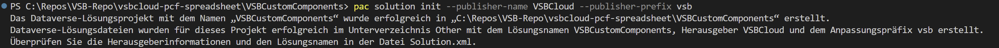
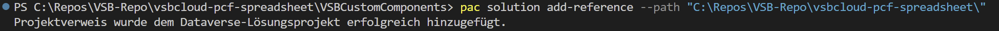
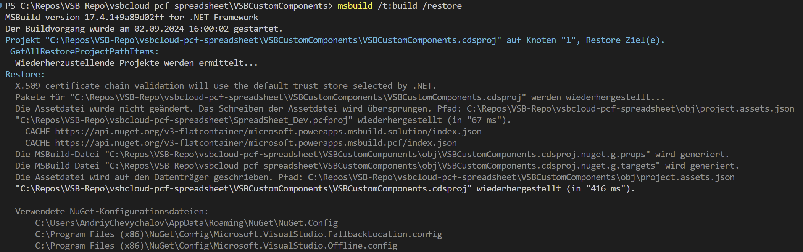
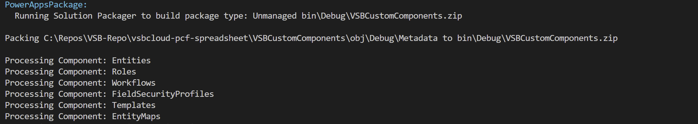

# Introduction 
TODO: Give a short introduction of your project. Let this section explain the objectives or the motivation behind this project. 

# Getting Started
TODO: Guide users through getting your code up and running on their own system. In this section you can talk about:
1.	Installation process
2.	Software dependencies
3.	Latest releases
4.	API references

# Build and Test
TODO: Describe and show how to build your code and run the tests. 

# Contribute
TODO: Explain how other users and developers can contribute to make your code better. 

If you want to learn more about creating good readme files then refer the following [guidelines](https://docs.microsoft.com/en-us/azure/devops/repos/git/create-a-readme?view=azure-devops). You can also seek inspiration from the below readme files:
- [ASP.NET Core](https://github.com/aspnet/Home)
- [Visual Studio Code](https://github.com/Microsoft/vscode)
- [Chakra Core](https://github.com/Microsoft/ChakraCore)

# Building and Deploying this PCF Control
TODO: Guide users through getting your code up and running on their own system. In this section you can talk about:

1.	Installation Solution

The first thing to do is create a subdirectory called Solution or you will run into the error “Error: CDS project creation failed. The current directory already contains a project. Please create a new directory and retry the operation.”. Create the subdirectory, then in the console go into that directory.

```bash
cd VSBCustomComponents

pac solution init --publisher-name VSBCloud --publisher-prefix vsb

```


1.	 Add reference to solution folder

Next, we need to add references to where our component is located, in our case:


```bash
pac solution add-reference --path "C:\Repos\VSB-Repo\vsbcloud-pcf-spreadsheet\"

```



1.	 Build soolution

Run the command below in the Solution directory

```bash
msbuild /t:build /restore

```



